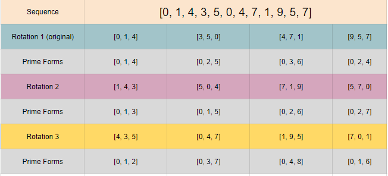

# Dodecaphonic Sequences and Prime Form Reduction
A somewhat constructive approach to finding dodecaphonic sequences of interest using python (3.0+).

## About and Explanation

### Overview
This project explores the intersection between music theory and mathematics, being its purpose that of research. It stems from the work of two professors, which was mostly theoretical. It allowed us to reach satisfying (and surprising) results.

### Technical Details

**On PC sets and Prime Forms** - *primeform_reduction.py*

The first concept which is pertinent to grasp is that of a pitch-class set. A pitch-class set (or PC set) is a set of pitches, which can have at most 12 pitches (see chromatic scale). From a mathematical point of view, it is merely a set of numbers, indexed from 0 to 11.

Now, using modular arithmetic (mod 12), we can analyze the intervals, as well as some other properties, that the pitches contained by some set share. From this, we find out that pc sets of some given length k <= 12 form an equivalence relation. This being, we have a partition of the set of all PC sets of length k; id est, we have equivalence classes.

This equivalence is of great matter, since it allows us to reduce any PC set to a "primitive" representative of its class: the prime form. Initially, one of the goals was to create a program that decomposes any given PC set (of any length) to its prime form, which was a success.

A more in-depth explanation can be found [here](https://musictheory.pugetsound.edu/mt21c/SetTheorySection.html).

**On Dodecaphonic Sequences of Interest** - *dodecaphonic_sequences.py*

A dodecaphonic sequence is any sequence of pitches [p0, ..., p11]. Note that a rotation of a sequence is any of the variations originated from transposing one of its pitches. See the image right below.

Our work aimed to answer the following:
**Given a heptatonic scale [p0, ..., p6], are there any dodecaphonic sequences within this scale that contain all possible PC set classes (for trichords) through some number of rotations?**

Here is one of the many results; this one for the scale [0, 1, 3, 4, 5, 7, 9]:

All results are in the *results.txt* file, which contains every sequence found for each valid scale. Observe that some scales simply don't allow representatives of one (or more) classes; those would be the invalid scales. One can check the validity of a scale at [this calculator](https://www.mta.ca/pc-set/calculator/pc_calculate.html).

**How the Algorithm Works**

Instead of an analytical approach, which would require going through all permutations of length 12 for all 12 pitches, a more constructive-inclined method was chosen.

> Lemma 1: every PC set class has a representative of the form [0, p1, ..., pn], with every pn being a pitch represented by a natural number such that 0 <= pn < 12. This implies that every sequence has a rotation of the form [0, p1, ..., p11].

By lemma 1, we know that it's possible to restrict ourselves to sequences that start with 0. Moreover, the algorithm builds sequences by appending adequate trichords to a given trichord of the form [0,a,b], thus creating only satisfying sequences.

The process is recursive. For every possible trichord T = [0,a,b] within a given scale, a distinct trichord (in relation to its prime form) is appended, and the appending process is repeated for each set of distinct trichords originated from it. This goes on until the number of trichords in the set is 12/3 = 4. By then, we'll have all possible sequences that satisfy our condition, at least in the first rotation, for the given initial trichord T. The last step is checking if we'll still have more distinct trichords for the next n rotations, being n an arbitrary number. (Though, calculating the number of rotations expected is easy when the length of the decomposing chords is known: for trichords, the number of rotations is 12/(12/3) = 12/4 = 3 rotations.)

## Running

Just download both *primeform_reduction.py* and *dodecaphonic_sequences.py* into the same folder and run the latter, changing parameters as you see fit. It will take some time, but the results will be progressively added to a text file inside the same folder, *valid_sequences.py*.
